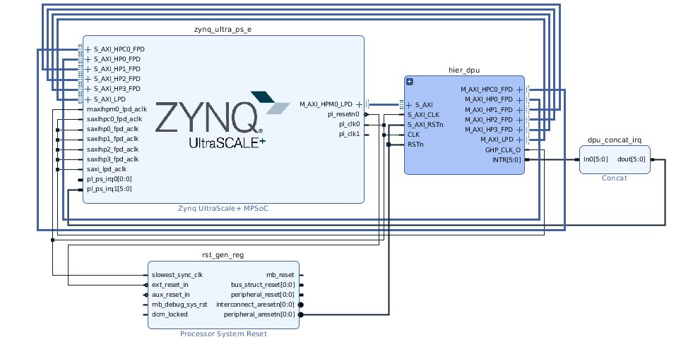

# Object-Detection-on-FPGA

## Step 1

Using vivado we connect the DPU ip with ZYNQ Ultrascale MPSoC with required clocks and resets.

The block diagram is as follows:

Generate bitstream for the above and export hardware.

Prebuilt version of this hardware and more details could be found [here.](https://github.com/Xilinx/Vitis-AI/tree/master/dsa/DPU-TRD/prj/Vivado)

## Step 2
