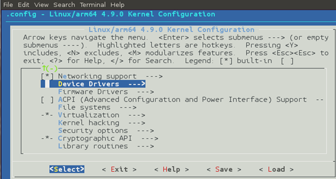
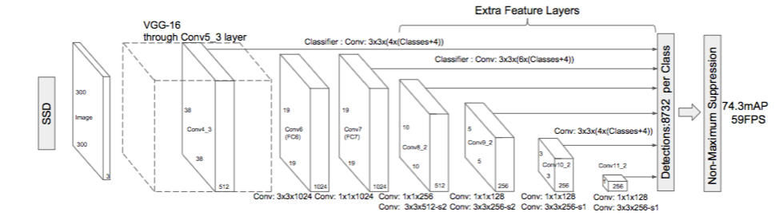
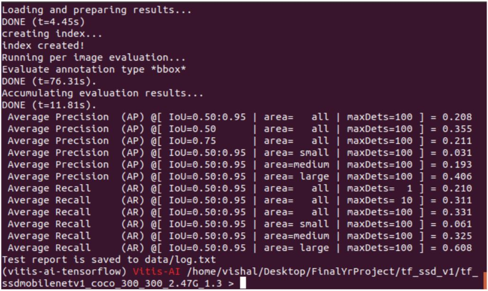
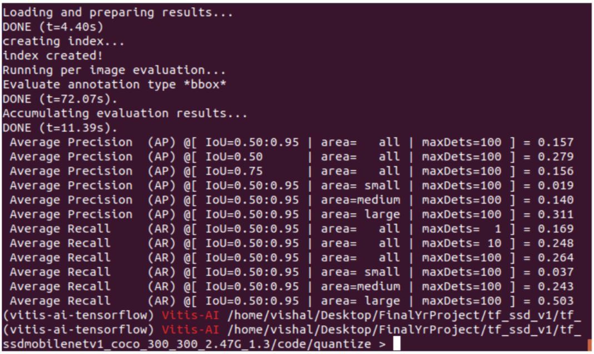

# Object-Detection-on-FPGA

## Step 1

Using vivado we connect the DPU ip with ZYNQ Ultrascale MPSoC with required clocks and resets.

The block diagram is as follows:

Generate bitstream for the above and export hardware.

Prebuilt version of this hardware and more details could be found [here.](https://github.com/Xilinx/Vitis-AI/tree/master/dsa/DPU-TRD/prj/Vivado)

## Step 2

For the software part using petalinux a project is built from the xsa file we exported earlier.

Here the device tree is defined and necessary drivers are defined.

For ZCU102 & ZCU104 evaluation kits these parameters are given in their [Github repo](https://github.com/Xilinx/Vitis-Tutorials/blob/master/Vitis_Platform_Creation/Introduction/02-Edge-AI-ZCU104/step2.md)

For MYIR board these parameters are added with this [repo](https://github.com/SV-1509/Object-Detection-on-FPGA/tree/main/MYIR%20board%20petalinux%20settings)

Next we can adjust the or tweak the dpu parameters using vitis if needed.

Once the software component is also ready we can obtain the architecture file(in .json format) and boot files for the board.

For the last 2 steps detailed tutorial could be found [here](https://github.com/Xilinx/Vitis-Tutorials/blob/master/Vitis_Platform_Creation/Introduction/02-Edge-AI-ZCU104/step3.md)

Note : This .json and boot files are readily available for ZCU 102 and ZCU 104, provided by xilinx. 
       They could be downloded from [ZCU 102](https://www.xilinx.com/bin/public/openDownload?filename=xilinx-zcu102-dpu-v2020.2-v1.3.1.img.gz) , [ZCU 104](https://www.xilinx.com/bin/public/openDownload?filename=xilinx-zcu104-dpu-v2020.2-v1.3.1.img.gz)

## Step 3 

Create and train an ssd model or get a pretrained model

Since training a model from scratch would take a lot of time and power we can download a petrained ssd model from [Vitis AI model zoo](https://github.com/Xilinx/Vitis-AI/tree/master/models/AI-Model-Zoo)

## Step 4

Install [docker](https://docs.docker.com/engine/install/)

Download and nstall the [vitis ai docker image](https://www.xilinx.com/html_docs/vitis_ai/1_3/installation.html)

Make use of [vai_q_tensorflow](https://www.xilinx.com/html_docs/vitis_ai/1_3/tensorflow_1x.html#zuc1592307653938) function provided by xilinx to quantize the 32 bit model we have to an 8bit model.

Results for accuracy of 32 bit and quantized 8 bit are as follows:

### 32 bit

### Quantized 8 bit

A decrease in accuracy occurs but this is expected.

This accuracy can be improved but [pruning](https://www.xilinx.com/html_docs/vitis_ai/1_3/pruning.html) and [optimizing](https://www.xilinx.com/support/documentation/sw_manuals/vitis_ai/1_2/ug1333-ai-optimizer.pdf)

The model file ready for deployment is complied using Vitis AI compiler .

Vitis ai compiler takes the quantized and optimized file and board arcitecture file we created in step 2 and makes an xmodel file.

An example of using compiler could be found [here](https://github.com/Xilinx/Vitis-Tutorials/blob/master/Machine_Learning/Design_Tutorials/07-yolov4-tutorial/scripts/compile_yolov4.sh)

The xmodel file ceated in this step contains the instruction set for our DPU ip.

## Step 5

Flash the boot files we created earlier to an SD card

Boot the board using this SD card.

Copy the compiled output files and other necessary libraries(VART), scripts for testing , and data to work on to the board via SSH.

Detailed explanation of this can be found [here](https://github.com/Xilinx/Vitis-AI/blob/master/tools/Vitis-AI-Library/README.md#quick-start-for-edge)

Run the scripts to benchmark the model or to run the model on realtime.

## Results

 

